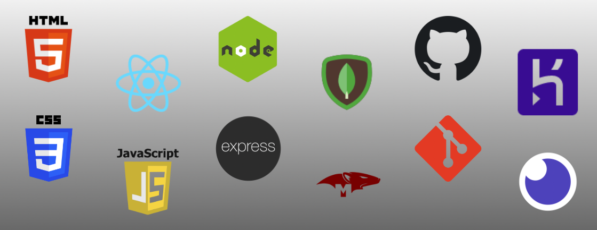
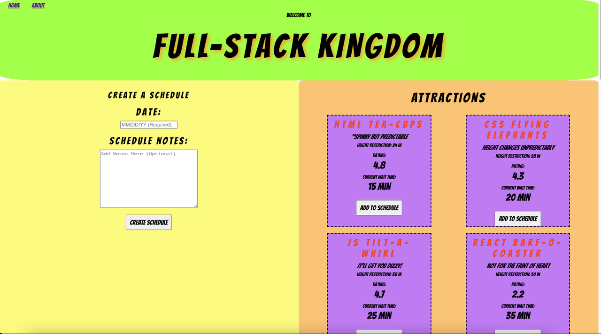
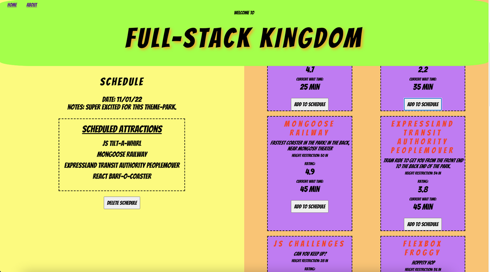

## Date: Nov 2, 2022

---

### **_Team Members_**

#### Josh Levine [Website](https://josh-levine.surge.sh/) | [GitHub](https://github.com/jadlevine) | [LinkedIn](https://www.linkedin.com/in/joshua-adam-levine/)

#### Olivia Schwartz [GitHub](https://github.com/OliviaSchwartz) | [LinkedIn](https://www.linkedin.com/in/olivia-c-schwartz/)

#### Roberto J Rodriguez [GitHub](https://github.com/robertojrodriguez21) | [LinkedIn](https://www.linkedin.com/in/robertojrodriguez21/)

#### Madeline Ashley [GitHub](https://github.com/mashbash2150) | [LinkedIn](https://www.linkedin.com/in/madeline-ashley/)

---

### **_Description_**

A MERN stack application for planning a day at the fictional "Full-Stack Kingdom".

---

### **_Technologies Used_**

---

### **_Getting Started_**

To use this application, use the deployed version on Heroku, [here](https://full-stack-kingdom-jal.herokuapp.com/)

You can see the planning of this project on Trello, [here](https://trello.com/b/P81pk3NA/theme-park-stack-a-thon)

Using the application

1. Begin by creating a schedule in the left panel. Include a date, and any notes, then click the **Create Schedule** button.
2. Scroll through the list of attractions in the right panel. For each attraction, you can view details about the attraction, and if interested, click the **Add to Schedule** button. The scheudle will automatically be updated anytime you add an attraction.
3. To start over, click the **Delete Schedule** button.

---

### **_Screenshots_**

#### Create Schedule Form

#### Active Schedule

## 

### **_Future Updates_**

- [x] ~~Link Delete Schedule functionality to back-end~~
- [x] ~~Make Attraction Cards scale to viewport size~~
- [ ] Add dynamic time budget to schedule
- [ ] Add filter options for attractions
- [ ] Add search functionality for attractions
- [ ] Add notes functionality to individual attractions, as they are added to a schedule
- [ ] Allow users to save and come back to schedules
- [ ] Allow users to update their schedule (remove attractions from schedule, rearrange order of attractions, etc...)

---

### **_Credits_**

Font: [Bangers](https://fonts.google.com/specimen/Bangers)
